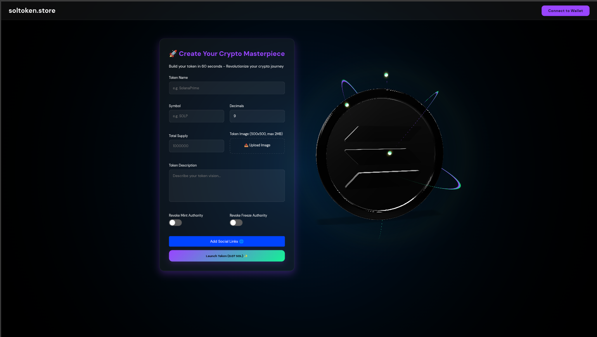
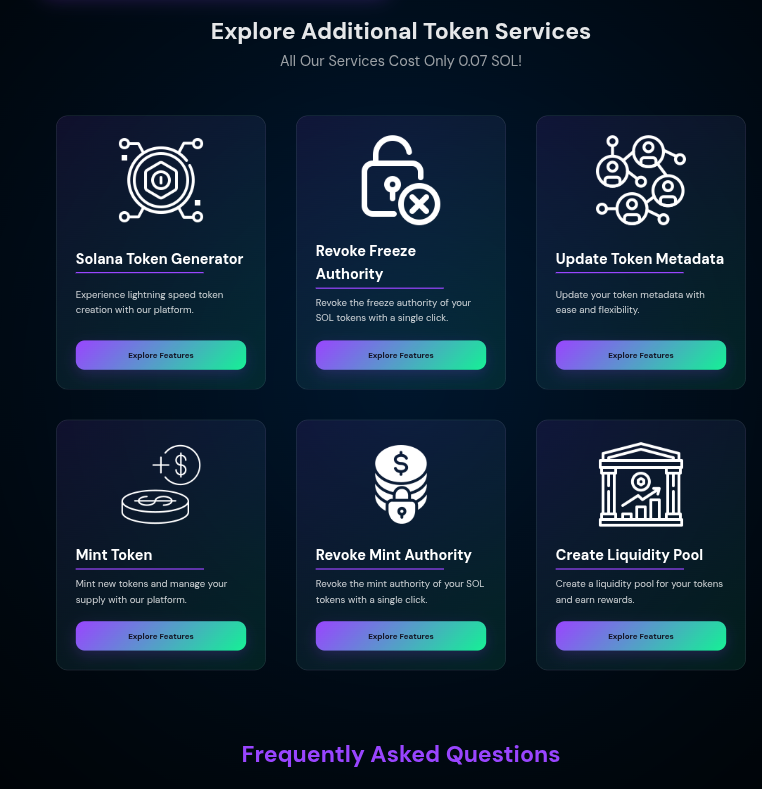

# Solana Memecoin Factory

<div align="center">
  
</div>

## 📖 Overview

**Solana Memecoin Factory** is a user-friendly web application that allows anyone to create, launch, and manage custom memecoins (or any tokens) on the Solana blockchain. Built with simplicity in mind, it empowers creators to generate tokens with just a few clicks, add liquidity, and deploy them instantly—all for a flat fee of 0.07 SOL.

This project is perfect for crypto enthusiasts, meme lords, developers, and entrepreneurs looking to experiment with Solana's high-speed, low-cost blockchain. No deep coding knowledge required—the app handles the heavy lifting via Solana's web3.js library.

### Key Highlights
- **Instant Token Creation**: Design your token with name, symbol, supply, decimals, image, description, and social links.
- **Solana-Powered**: Leverages Solana's ecosystem for fast, cheap transactions.
- **User-Friendly Interface**: Modern UI with real-time previews, 3D coin animations, and wallet integration (e.g., Phantom).
- **Additional Tools**: Revoke authorities, update metadata, create liquidity pools, and more—all at the same low fee.
- **SEO-Optimized**: Built-in meta tags, FAQ schema, and structured data for better search visibility.
- **Open-Source**: Fork, customize, and contribute!

Whether you're launching a fun memecoin or a serious utility token, this factory streamlines the process while following best practices for security and deployment.

## ✨ Features

### Core Token Creation
- **Form-Based Input**: Easily enter token details:
  - Name (e.g., "SolanaPrime")
  - Symbol (e.g., "SOLP")
  - Decimals (default: 9)
  - Total Supply (e.g., 1,000,000)
  - Image Upload (500x500px, max 2MB; auto-preview)
  - Description (textarea for your token's story)
  - Social Links (Website, X, Telegram, YouTube—expandable section)
- **Authority Controls**:
  - Revoke Mint Authority (toggle to prevent further minting)
  - Revoke Freeze Authority (toggle to prevent freezing accounts)
- **Launch Button**: Pay 0.07 SOL and deploy your token to Solana mainnet. Integrates with Raydium for optional liquidity pools.

### Visual Preview
- **3D Coin Animation**: Uses Google's Model-Viewer to display a rotating, AR-enabled token preview (loads `untitled.gltf` model).
- **Real-Time Updates**: As you fill the form, see your token come to life in the preview pane.

### Additional Services
The app includes a section for extra token management tools (each at 0.07 SOL):
- **Solana Token Generator**: Core creation tool.
- **Revoke Freeze Authority**: Secure your token post-launch.
- **Update Token Metadata**: Edit name, symbol, image, etc., after deployment.
- **Mint Token**: Add more supply if mint authority isn't revoked.
- **Revoke Mint Authority**: Lock supply permanently.
- **Create Liquidity Pool**: Set up trading on Raydium.

### Wallet Integration
- **Connect Wallet**: Supports Phantom (and expandable to others).
- **Modal Popup**: Clean UI for selecting and connecting wallets.
- **Transaction Handling**: Uses `@solana/web3.js` for signing and sending transactions.

### SEO and Content
- **Hero Banner**: Eye-catching intro with scrolling stats (e.g., "5000+ Meme Coins Created").
- **FAQ Section**: Accordion-style answers with schema.org markup for rich search results.
- **Footer Support**: Email link for queries.

### Technical Stack
- **Frontend**: HTML5, CSS3 (custom styles in `style.css`), JavaScript (ES6+).
- **Libraries**:
  - `@solana/web3.js`: For blockchain interactions.
  - `@google/model-viewer`: For 3D model rendering.
  - No heavy frameworks—keeps it lightweight and fast.
- **Scripts**:
  - `wallet.js`: Handles wallet connection and Solana interactions.
  - `script.js`: Form logic, toggles, uploads, and event listeners.
- **Assets**:
  - Images: Logos, icons, and GLTF models in `/Images/`.
  - Favicons: Full set for cross-device support.

## 🚀 Quick Start

### Prerequisites
- Node.js (for local server, optional but recommended).
- A Solana wallet (e.g., Phantom) with some SOL for testing.
- Git (to clone the repo).

### Installation
1. Clone the repository:
   ```
   git clone https://github.com/abdulrahmanJAlabbed/Solana-Memecoin-Factory
   cd Solana-Memecoin-Factory
   ```

2. No dependencies to install—it's pure HTML/JS/CSS!

### Running Locally
To avoid CORS errors (common when opening `index.html` directly via `file://`), use a local web server:

- **With VS Code**:
  1. Install the "Live Server" extension.
  2. Right-click `index.html` > "Open with Live Server".
  3. Access at `http://127.0.0.1:5500/index.html`.

- **With Node.js**:
  1. Install serve: `npm install -g serve`
  2. Run: `serve .`
  3. Open `http://localhost:3000/index.html`.

- **With Python**:
  1. Run: `python3 -m http.server 8000`
  2. Open `http://localhost:8000/index.html`.

Once running, connect your wallet, fill the form, and launch a test token (use Solana Devnet for free testing by modifying `wallet.js`).

### Deployment
Deploy to GitHub Pages, Vercel, or any static host for free:

1. **GitHub Pages**:
   - Push to GitHub.
   - Go to repo Settings > Pages > Source: main branch > Save.
   - Access at `https://YOUR_USERNAME.github.io/solana-memecoin-factory`.

2. **Vercel**:
   ```
   npm i -g vercel
   vercel
   ```
   Follow prompts—deploys in seconds.

3. For production: Update Solana cluster to `mainnet-beta` in `wallet.js`.

### Screenshots
- **Home Page**:
  

- **Other Services**:
  

- **3D Preview**:
## 🧊 3D Model Preview

<video src="./Extra/Screencast from 2025-11-06 11-07-55.webm" autoplay loop muted playsinline width="600"></video>

👉 [View Interactive Model Here](https://abdulrahmanjalabbed.github.io/Solana-Memecoin-Factory/Extra/index.html)


## 🛠 Usage Guide

1. **Connect Wallet**: Click "Connect to Wallet" > Select Phantom > Approve.
2. **Fill Form**: Enter token details. Upload an image (it auto-previews).
3. **Toggle Options**: Enable revokes if desired.
4. **Add Socials**: Click "Add Social Links" to expand and input URLs.
5. **Launch**: Click "Launch Token (0.07 SOL)" > Confirm transaction in wallet.
6. **Post-Launch**: Use additional cards for management (e.g., create liquidity).

**Tips**:
- Test on Devnet first to avoid real SOL fees.
- Ensure image is square and under 2MB.
- For custom models: Replace `untitled.gltf` in `/Images/`.

## 🔧 Troubleshooting
- **CORS Errors**: Always use a local server (as you did—glad it resolved!).
- **Wallet Not Connecting**: Check Phantom extension is installed and unlocked.
- **Model Not Loading**: Verify path to `untitled.gltf` and server is running.
- **Transaction Fails**: Ensure sufficient SOL balance and correct network.

If issues persist, open an Issue on GitHub.

## 🤝 Contributing
We welcome contributions! Fork the repo, make changes, and submit a PR.

1. Fork it.
2. Create feature branch: `git checkout -b feature/AmazingFeature`
3. Commit: `git commit -m 'Add AmazingFeature'`
4. Push: `git push origin feature/AmazingFeature`
5. Open PR.

## 👥 Community
- Star ⭐ this repo if it helped!


Built with ❤️ by Abdulrahman. Let's meme the world on Solana! 🚀
